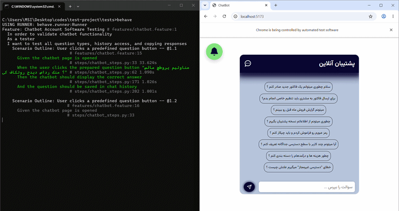

# ChatBot App 💬

<p align="center">
  
</p>

<p align="center">  </p>

A full-stack chat application built with React, Node.js, Express, and MongoDB. The project provides a chatbot-style interface with real-time message handling and a backend API for managing conversations.

## Demo

Live frontend preview:

[👁️ test-project-r4mo.vercel.app](https://test-project-r4mo.vercel.app/)

---

## About

This project was developed as a full-stack chat application to practice building and integrating frontend and backend systems.

The application features an interactive chatbot interface, API communication between the client and server, and a MongoDB database for data persistence. The architecture was designed to be modular and easy to extend with additional chatbot functionality, authentication, or external AI integrations.

In addition to the application itself, the project includes automated test cases written with Behave to help verify functionality and support future development.

---

## Features

* Interactive chat interface
* Real-time message handling
* Backend API integration
* MongoDB database support
* Modular and extensible architecture
* Automated test cases

---

## Tech Stack

### Frontend

* React
* React Router

### Backend

* Node.js
* Express

### Database

* MongoDB

### Testing

* Behave (Python)

---

## Requirements

Before running the project locally, make sure you have:

* Node.js 18+
* npm
* MongoDB
* Python 3.x (for running tests)

---

## Installation

Clone the repository:

```bash
git clone https://github.com/NiushaEbrahimi/chatbot-test-project.git
cd chatbot-test-project
```

Install frontend dependencies:

```bash
cd frontend
npm install
```

Install backend dependencies (in another terminal):

```bash
cd backend
npm install
```

---

## Running the Application

Start the frontend:

```bash
cd frontend
npm run dev
```

Start the backend:

```bash
cd backend
npm start
```

---

## Running Test Cases

Navigate to the tests directory:

```bash
cd tests
```

Install the required Python packages:

```bash
pip install -r requirements.txt
```

Run the test suite:

```bash
behave
```

---

## License

This project is intended for learning and experimentation.
